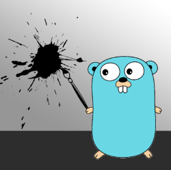

# goink
Golang Incremental Testing Library



This package can be run at any go program root, and only tests incremental changes from a previous git commit.

### How to run
Use the command go get this library and install it on your GOPATH.
```
go get github.com/braincorp/goink
```
you should now be able to run the `--help` command. By defualt, the command will be installed on your gopath.
```
goink --help
```

### How to use
Goink uses watches changes using git, and walks the dependency tree of your go program, finding the packages that have changed.
It then only tests the changed packages and their dependencies using `go test`. It works essentiall as below
```
find changed files -> find changed packages -> check main packages for dependency
```

### Why go list
Some similar packages use the "go/build" build context to walk the AST tree as if we were compiling the program. On the other hand, I decided to call out to `go list`. To me, this is the prefered method since the parralalization is handled by `go list` and `go list` is fast. The multi depth dependencies are also resolved and stored so I can check packages for dependencies without walking. There was no reason to reimpliment `go list`.

### Similar Projects

https://github.com/kisielk/godepgraph (uses the internal "go/build" package to import)


Have fun, and go Ink it! :)
